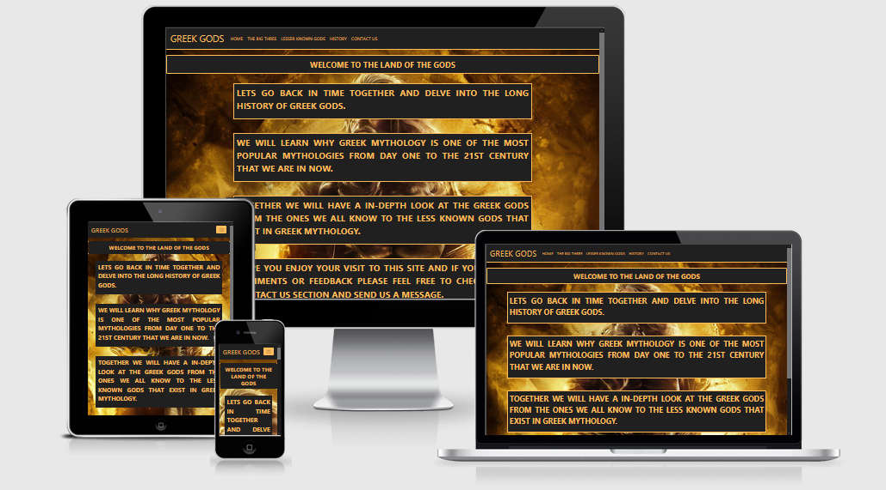

# MS1-Project - Legend Of The Greek Gods

[Here is a link to the final project](https://manni8436.github.io/MS1-Project/)

## INITIAL DESIGN
*   My initial idea for this project was to create an informative website about the Greek Gods. My target audience is anyone who is interested in Greek Mythology,
    this can cover a huge spectrum of ages, genders and interest levels. This ranges from children who want to learn about the Greek Gods, to anyone who wants to 
    use the site for projects, to those who just want to read something fun and interesting.

* The main features that I wanted to include are:
    
    * Easy to use navigation menu.
    * Easy to read information.
    * A black and gold colour scheme that stands out, but is not overwhelming.

## FINAL DESIGN

## CONTENTS

* [User Experience](#USER-EXPERIENCE)  
    * [User Stories](#USER-STORIES)    

* [Design](#DESIGN)   
    * [Color Scheme](#COLOR-SCHEME)

* [Wireframes](#WIREFRAMES) 

* [Technologies Used](#TECHNOLOGIES-USED) 
    * [Languages Used](#LANGUAGES-USED)
    * [Programs Used](#PROGRAMS-USED)

* [Deployment](#DEPLOYMENT)
    * [Initial Deployment](#INITIAL-DEPLOYMENT)
    * [How To Fork A Repository](#HOW-TO-FORK-A-REPOSITORY)
    * [How To Clone A Repository](#HOW-TO-CLONE-A-REPOSITORY)
    * [How To Make A Local Clone](#HOW-TO-MAKE-A-LOCAL-CLONE)

* [Testing](#TESTING)
    * [Code Validators](#CODE-VALIDATORS)

* [Content](#CONTENT)
    * [Images](#IMAGES)
    * [Text Content](#TEXT-CONTENT)

* [Acknowledgements](#ACKNOWLEDGEMENTS)    

## USER EXPERIENCE

The structure of the site was designed to be simple and easy to use and have a good content balance as to not
overload the user and give them enough information as not leave them lost or needing more knowledge.

* The website is for the following users types:
    
    * Users that has no previous knowledge of the stories, history, characters and see what they used to look like.
    * Users with basic knowledge of the Greek history but were looking for more information and increase their knowledge base.
    * Users who have good knowledge of the Greek history but want to refresh the knowledge or do some research or even just enjoy reading about the history of all the gods.

## USER STORIES

#### CLIENT GOALS

* The site needs to be easily accessible.
* The navigation menu to be simple to use from desktop to smaller devices.
* Manouvering around the site to be simple and straightforward.
* For the site to be informative, easy to read and see the images clearly.

#### FIRST TIME VISITORS
* I want it to be easy to understand how to navigate throughout the site.
* I want the content to be easily read and understandable.

## DESIGN

### COLOR SCHEME

My overall color scheme used throughout the site.

 

with white text writing in the forms section in the [Contact Us](https://manni8436.github.io/MS1-Project/contactus.html) page.

## WIREFRAMES

[Here are my wireframes for desktop, mobile and tablet for this project](assets/wireframes/MSProject1Wireframes.pdf)

## FEATURES

* The following is the Features that I have used for my project.    
    
    * Hover feature which tells the user what location the mouse is in while in the menu.
        * simple function so that the user does not lose its place in the menu and get confused.
        
    * Contact form validates and requests the user to input information in the input boxes and textarea.
        * this stops the user from accidently sending blank or incomplete contact details and information needed.    

## SOLVED BUGS

* All my background images didnt fit on the screen properly, especially the home page as the top of the image was getting cut off and as a result I changed 
the `background-position` from `background-position: center center;` to `background-position: top center;`

* I ran my code through W3C validators, and I was given an error of `duplicate attribute class` and after closer inspection of this issue, I was able to find a solution, 
as a result I added `img-fluid` and `d-block w-100` all into one `class=" "` also rechecked all pages once again through the W3C Code Validator and there were no further errors.

## TECHNOLOGIES USED

###  LANGUAGES USED

      

### PROGRAMS USED:

#### Font Awesome:
[Font Awesome](https://fontawesome.com/) was used for a few icons used in the footer aspect of the site pages.

#### Google Fonts:
[Google Fonts](https://fonts.google.com/) was used for all the text content on the site pages.

#### GitPod:
GitPod was used to write up the code for my project and using the GitPod terminal to commit everything to GitHub.
    
#### GitHub:
GitHub is being used to store all the code for this project after being pushed from GitPod.

#### Balsamiq:
Balsamiq was used in the initial design process to make wireframes.

#### Firefox Developer Tools:
Firefox Developer Tools was used for trouble shooting and trying new visual changes without it affecting the current code already created.

## DEPLOYMENT:

### INITIAL DEPLOYMENT

This site was deployed using GitHub Pages with the following the steps below:

1. Login or Sign Up to [GitHub](www.github.com).
2. Create a new repository named "MS1-Project".
3. Once created, click on "Settings" on the navigation bar under the repository title.
4. Click on "Pages", on the left hand side below Secrets.
5. Under "Source", choose which branch you wish to deploy, In most cases it will be "main".
6. Choose which folder to deploy from, generally from "/root".
7. Click "Save", then wait for it to be deployed. It may take some time for the page to be fully deployed.
8. The URL will be displayed above the "source" section in GitHub Pages.

### HOW TO FORK A REPOSITORY

If you need to make a copy of a repository:

1. Login or Sign Up to [GitHub](www.github.com).
2. On GitHub, go to [manni8436/MS1-Project](manni8436/MS1-Project).
3. In the top right corner, click "Fork".

### HOW TO CLONE A REPOSITORY

If you need to make a clone:    

1. Login in to [GitHub](www.github.com).
2. Fork the repository manni8436/MS1-Project using the steps above in [How To Fork a Repository](#HOW-TO-FORK-A-REPOSITORY).
3. Above the file list, click "Code".
4. Choose if you want to close using HTTPS, SSH or GitHub CLI, then click the copy button to the right.
5. Open Git Bash.
6. Change the directory to where you want your clone to go.
7. Type git clone and then paste the URL you copied in step 4.
8. Press Enter to create your clone.

### HOW TO MAKE A LOCAL CLONE

If you need to make a local clone:   

1. Login in to [GitHub](www.github.com).
2. Under the repository name, above the list of files, click "Code".
3. Here you can either Clone or Download the repository.
4. You should close the repository using HTTPS, clicking on the icon to copy the link.
5. Open Git Bash.
6. Change the current working directory to the new locaiton, where you want the cloned directory to be.
7. Type git clone and then paste the URL you copied in step 4.
8. Press Enter, and your local clone will be created.

## TESTING

### CODE VALIDATORS

The W3C Markup Validator and W3C CSS Validator was used to validate my project to make sure there were no errors within the site.
The only errors were found was `class="img-fluid"` which was used to make the images responsive and `class="d-block w-100"` which was a bootstrap class for the image cards.

* W3C HTML Validator Results
    * [Home Page](https://validator.w3.org/nu/?doc=https%3A%2F%2Fmanni8436.github.io%2FMS1-Project%2Findex.html)
    * [Big Three](https://validator.w3.org/nu/?doc=https%3A%2F%2Fmanni8436.github.io%2FMS1-Project%2Fthebigthree.html)
    * [Lesser Known Gods](https://validator.w3.org/nu/?doc=https%3A%2F%2Fmanni8436.github.io%2FMS1-Project%2Flesserknowngods.html)
    * [History](https://validator.w3.org/nu/?doc=https%3A%2F%2Fmanni8436.github.io%2FMS1-Project%2Fhistory.html)
    * [Contact Us](https://validator.w3.org/nu/?doc=https%3A%2F%2Fmanni8436.github.io%2FMS1-Project%2Fcontactus.html)

* W3C CSS Validator Results
    * [CSS](http://www.css-validator.org/validator?uri=https%3A%2F%2Fmanni8436.github.io%2FMS1-Project%2Findex.html&profile=css21&usermedium=all&warning=1&lang=en)

### FULL TESTING

[Click Here](testing.md) to view the full testing steps that were completed on every device and browser.

### LIGHTHOUSE

* I tested my website using Firefox Developer Tools Lighthouse feature, and received the results below:

### DESKTOP
* Home Page

.png)

* The Big Three

.png)

* Lesser Known Gods

.png)

* History

.png)

* Contact Us

.png)

### MOBILE
* Home Page

.png)

* The Big Three

.png)

* Lesser Known Gods

.png)

* History

.png)

* Contact Us

.png)

## CONTENT

### IMAGES

* Images mainly provided by wikipedia and pinterest but a full list have been provided below:

    * Background Images:
        * [Home Page](https://wallpaperaccess.com/zeus)
        * [Big Three](https://omniversal-battlefield.fandom.com/wiki/Poseidon_(Greek_Mythology)?file=Poseidon.jpg)
        * [Lesser Known Gods](https://www.artstation.com/artwork/1YzOK)
        * [History](https://www.artstation.com/artwork/1YzOK)
        * [Contact Us](https://www.ancient-origins.net/myths-legends-europe/hermes-0011776) 

    * Big Three Main Images:
        * [Zeus](https://en.wikipedia.org/wiki/Zeus)
        * [Poseidon](https://en.wikipedia.org/wiki/Poseidon )
        * [Hades](https://en.wikipedia.org/wiki/Hades)
     
    * Lesser Known Gods Main Images
        * [Atlas](https://en.wikipedia.org/wiki/Atlas_(mythology))
        * [Heracles](https://en.wikipedia.org/wiki/Heracles)
        * [Amphitrite](https://www.pinterest.com/pin/423831014921428350/)
        * [Asclepius](https://en.wikipedia.org/wiki/Asclepius)
        * [Pan](https://www.pinterest.co.uk/pin/410109109794860381/)
        * [Nike](https://www.pinterest.co.uk/pin/111182684540958323/)
 
    * Carousel Images:
        * [Mount Olympus](https://www.pinterest.co.uk/pin/111182684540958323/)
        * [Temple of Zeus](https://en.wikipedia.org/wiki/Temple_of_Olympian_Zeus,_Athens#History)
        * [Temple of Poseidon](https://en.wikipedia.org/wiki/Temple_of_Poseidon,_Sounion)
        * [Parthenon](https://www.visionpubl.com/en/cities/athens/parthenon-facts-history/)
        * [Ancient Olympia Stadium](https://yallatoursblog.com/2014/01/27/faster-higher-stronger-in-ancient-olympia/)

### TEXT CONTENT

* Text content on all Pages was copied and/or amended from the following sites:  
    
    * [Parthenon](https://www.visionpubl.com/en/cities/athens/parthenon-facts-history/)
    * [Ancient Olympia](https://yallatoursblog.com/2014/01/27/faster-higher-stronger-in-ancient-olympia/)
    * [Acropolis of Athens](https://en.wikipedia.org/wiki/Acropolis_of_Athens#History)
    * [Temple of Hera, Olympia](https://en.wikipedia.org/wiki/Temple_of_Hera,_Olympia)
    * [Second link for Temple of Hera, Olympia](https://www.greeka.com/peloponnese/olympia/sightseeing/temple-hera/)
    * [Heracles and The Twelve Labors](https://www.history.com/.amp/topics/ancient-history/greek-mythology)
    * [Zeus](https://en.wikipedia.org/wiki/Zeus)
    * [Poseidon](https://en.wikipedia.org/wiki/Poseidon)
    * [Hades](https://en.wikipedia.org/wiki/Hades)
    * [Atlas](https://en.wikipedia.org/wiki/Atlas_(mythology))
    * [Hercules/Heracles](https://en.wikipedia.org/wiki/Hercules#Mythology)
    * [Amphitrite](https://en.wikipedia.org/wiki/Amphitrite#Mythology)
    * [Asclepius](https://en.wikipedia.org/wiki/Asclepius)
    * [Pan](https://www.pinterest.co.uk/pin/410109109794860381/)
    * [Nike](https://en.wikipedia.org/wiki/Nike_(mythology))
    
## ACKNOWLEDGEMENTS:

I would like to give a big thanks to [Chris Quinn](https://github.com/10xOXR) for all his help, effort, guidance
and patience he has provided during this project.

I would also like to thank [Abi Harrison](https://github.com/Abibubble) for all her support, advice and explaining things to me when I did not understand.